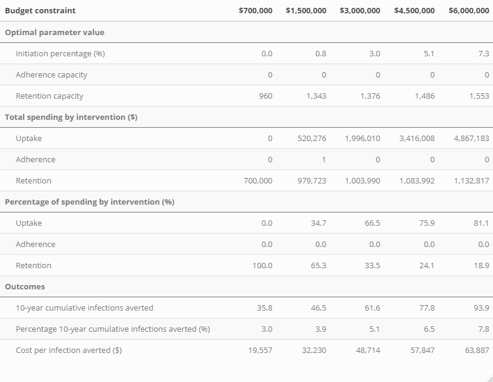

# Overview

The central question is: how should we allocate a fixed budget to three PrEP support interventions to maximize the number of HIV infections averted over the course of 10 years among MSM in Atlanta?

The model parameters representing policy levers being considered:

•	POIP – percentage of MSM reached by initiation intervention

•	POAC – adherence intervention capacity (max. number of people who can receive the intervention per year)

•	PORC – retention intervention capacity (max. number of people who can be active in the intervention in any given week)

These are synonymous with "Uptake Capacity", "Adherence Capacity", and "Retention Capacity".

```{r setup, include=FALSE}
knitr::opts_chunk$set(echo = FALSE, warning = FALSE, message = FALSE)
# Required packages
library(dplyr)
library(psych)
library(ggplot2)
library(tidyverse)
# package for generalized additive models (gam)
library(mgcv)
library(patchwork)
library(kableExtra)
library(nima)
library(viridis)
library(metR)
library(lubridate)
library(scales)
library(RColorBrewer)

# Import optimization results
load("optim_data/optim_res_table.rda")
table_optim <- res

load("optim_data/optim_res_adh.rda")
adh_optim <- res

load("optim_data/optim_res.rda")
# Import simulation output
# df_prep <- readRDS("C:/Users/Greg/Desktop/PrEP-Optimize/analysis/data/prepOptim-Yearly-v4-1000sets-250per.rds")
df_prep <- readRDS("data/prepOptim-Yearly-v4-1000sets-250per.rds")
# Linear costs for PrEP support program capacities
cost.i <- (12/6 * 10 * (80 * 395 * 100) + (10 * (46.5 + 0.1*(2*40 + 2*17.85 + 2*80.31)) * 80 * 100))
cost.a <- ((315.18+246+3.90) * 10)
cost.r <- 10 * (60.5 + 0.1*(40*4 + 17.85*2 + 80.31*2 + 9.46*2) + 12.44)
```

```{r data_cleaning, include = FALSE}
# translate weekly adherence capacity into yearly capacity
df_prep$POAC_yr <- df_prep$POAC*52

# calculate 10-year outcomes
df_prep_10yr <- full_join(df_prep %>% group_by(scenario) %>%
                            summarise_at(vars(incid, infAvert, PrEPStarts),
                                         sum),
                          df_prep %>% group_by(scenario) %>%
                            summarise_at(vars(PrEPHighAdr, prepElig, prepCurr, PrEPHighAdr),
                                         mean),
                          by="scenario")

df_prep_10yr <- full_join(df_prep_10yr,
                          df_prep %>% group_by(scenario) %>%
                            summarise_at(vars(pCov),
                                         last),
                          by="scenario")

df_prep_10yr <- full_join(df_prep_10yr,
                          df_prep %>% group_by(scenario) %>%
                            summarise_at(vars(POIP, PORC, POAC_yr),
                                         first),
                          by = "scenario")

df_prep_10yr <- full_join(df_prep_10yr,
                          df_prep %>% group_by(scenario) %>%
                            summarise_at(vars(OptimInitStarts, OptimAdhrStarts, OptimRetnStarts),
                                         sum),
                          by="scenario")

```

# Simulation Output Exploration

The outcome we are looking at in Figure 1 is the average proportion of active PrEP users who are highly adherent. We expect this proportion to go up with increasing adherence intervention capacity. At a certain point, this highly adherent proportion stops increasing with adherence capacity because all new PrEP users are already enrolled in the adherence intervention. When the uptake intervention is well-funded (High PrEP Uptake), a greater adherence capacity can be utilized. Consequently, we see the proportion of active PrEP users who are highly adherent start to plateau at a lower adherence capacity when PrEP uptake is also low. "Low PrEP Uptake" and "High PrEP Uptake" are coded as the simulations with the lowest and highest quartiles of the parameter that controls the initiation intervention capacity.

```{r high_adherence_plot,fig.width=9, fig.height=6}

df_prep_10yr$POIP_cat <- cut(df_prep_10yr$POIP, quantile(df_prep_10yr$POIP, c(0, .25, .75, 1)), labels = c("Low PrEP Uptake", "Medium PrEP Uptake", "High PrEP Uptake"), include.lowest = TRUE)

ggplot(df_prep_10yr, aes(x = POAC_yr, y = PrEPHighAdr, color = POIP_cat)) + 
  geom_jitter() + 
  scale_color_manual(values = c("#D55E00", "#999999", "#009E73")) +
  labs(title = "Figure 1",
       y = "High Adherence Proportion",
       x = "Yearly Adherence Intervention Capacity",
       color = "Initiation Intervention Capacity Level") +
  theme_classic()
```

The y-axis on Figure 2 denotes the mean proportion of the PrEP eligible population that is actively taking PrEP for each simulation over the course of the 10 year time horizon. Increasing the rate of PrEP uptake and the average length of time each PrEP user stays on the medication will both raise overall coverage levels. Increasing retention intervention capacity raises coverage levels until the capacity exceeds the number of PrEP users who can utilize the capacity. Increasing PrEP uptake shifts this point of excessive retention capacity to a higher value. Visually speaking, it appears that marginal effect of retention capacity on PrEP coverage is the same at all levels of PrEP uptake, except in the space where retention capacity exceeds demand. If infections averted is a function of PrEP coverage, then this suggests that the lack of a synergistic interaction between the uptake and retention interventions when retention demand is not exceeded. "Low PrEP Uptake" and "High PrEP Uptake" are coded as the simulations with the lowest and highest quartiles of the parameter that controls the initiation intervention capacity.

```{r pCov_porc_plot, fig.width=9, fig.height=6}
ggplot(df_prep_10yr, aes(x = PORC, y = pCov, color = POIP_cat)) + 
  geom_jitter() + 
  scale_color_manual(values = c("#D55E00", "#999999", "#009E73")) +
  labs(title = "Figure 2",
       y = "PrEP Coverage Proportion",
       x = "Retention Intervention Capacity",
       color = "Initiation Intervention Capacity Level") +
  theme_classic()
```

Figure 3 shows the same dynamics in a slightly different way than Figure 2. The parameter represented by the x-axis on Figure 3 (PrEP Intervention Initiation Percentage) is the percentage of individuals newly indicated for PrEP who become actively engaged in the initiation intervention. The higher retention capacity values do not lead to an increase in PrEP coverage, and the relationship between coverage levels and the initiation intervention capacity parameter appears to be roughly linear and independent of retention capacity. 

```{r pCov_poip_plot, fig.width=9, fig.height=6}
df_prep_10yr$PORC_cat <- cut(df_prep_10yr$PORC, quantile(df_prep_10yr$PORC, c(0, .25, .75, 1)), labels = c("Low Retention Capacity", "Medium Retention", "High Retention Capacity"), include.lowest = TRUE)

ggplot(df_prep_10yr, aes(x = POIP, y = pCov, color = PORC_cat)) + 
  geom_jitter() + 
  scale_color_manual(values = c("#D55E00", "#999999", "#009E73")) +
  labs(title = "Figure 3",
       y = "PrEP Coverage Proportion",
       x = "PrEP Intervention Initiation Percentage (Uptake Intervention Capacity)",
       color = "Retention Intervention Capacity Level") +
  theme_classic()

# saveRDS(df_prep_10yr, file = "optim_data/df_prep_10yr.rds")  
```

# Statistical Modeling

So far, we have only described the relationship between the parameters controlling the capacity of PrEP support interventions and intermediate outcomes in an exploratory fashion. To answer our research question within a mathematical optimization framework, we need to reduce the the messiness of the simulation data down to smooth functions of the policy parameters of interest. 

We use a generalized additive model (GAM) to fit a flexible and smooth function to our simulation output. In this statistical modeling approach, our outcome is the percent of cumulative infections averted over the course of 10 years, and the predictors of interest are uptake program initiation proportion, retention program capacity, and adherence program capacity. Like generalized linear models, GAMs are specified by a link function and a mean variance relationship (family). Because our outcome (percent infections averted) is positive and continuous, we used a Gamma family mean-variance relationship. Even though the percentage of cumulative infections averted is technically bounded between 0 and 100, we never see enough infections averted for this upper bound impact our choice of family for the statistical model. We chose to use a log link function because it provided the best fit to our data in terms of the minimized generalized cross-validation (GCV) score, which is used for smoothness selection in the mgcv package in R. In GAMs, relationships between the individual predictors and the dependent variable follow smooth patterns that can be nonlinear, which is necessary for capturing the relationships that we observed in the exploratory analysis of the simulation output.

```{r gam_fit}
gam <- gam(data = df_prep_10yr,
           formula = 100*(infAvert/1199.484) ~ s(POIP, k = 5) + s(POAC_yr, k = 5) + s(PORC, k = 6) + ti(POIP, PORC, k = 6) + ti(POIP, POAC_yr, k = 3) + ti(PORC, POAC_yr, k = 6),
           family = Gamma(link = "log"), method = "REML")

# saveRDS(gam, file = "optim_data/gam.rds")
```

### Uptake/Retention Interaction 

We can visualize the generalized additive model predictions for infections averted to get a sense of how the program parameters interact and affect outcomes. On the three dimensional and contour plots, the axes span the entire allowable range of each capacity parameter (Uptake Capacity: 0-0.10, Adherence Capacity: 0-2000, Retention Capacity: 0-2000). 

```{r vis_gam}
vis.gam(gam, view = c("PORC", "POIP"), type = "response", theta = -45, xlab = "Retention Capacity", ylab = "Uptake Capacity", zlab = "% Infections Averted", main = "Figure 4: % Infections Averted 3D - Uptake/Retention")
vis.gam(gam, view = c("PORC", "POIP"), plot.type = "contour", type = "response", xlab = "Retention Capacity", ylab = "Uptake Capacity", main = "Figure 5: % Infections Averted Contour - Uptake/Retention")
```

### Uptake/Adherence Interaction

```{r}
vis.gam(gam, view = c("POAC_yr", "POIP"), type = "response", theta = -45, xlab = "Adherence Capacity", ylab = "Uptake Capacity", zlab = "% Infections Averted", main = "Figure 6: % Infections Averted 3D - Uptake/Adherence")
vis.gam(gam, view = c("POAC_yr", "POIP"), plot.type = "contour", type = "response", xlab = "Adherence Capacity", ylab = "Uptake Capacity", main = "Figure 7: % Infections Averted Contour - Uptake/Adherence")
```

### Adherence/Retention Interaction

```{r}
vis.gam(gam, view = c("POAC_yr", "PORC"), type = "response", theta = -45, xlab = "Adherence Capacity", ylab = "Retention Capacity", zlab = "% Infections Averted", main = "Figure 8: % Infections Averted 3D - Retention/Adherence")
vis.gam(gam, view = c("POAC_yr", "PORC"), plot.type = "contour", type = "response", xlab = "Adherence Capacity", ylab = "Retention Capacity", main = "Figure 9: % Infections Averted Contour - Retention/Adherence")
```

### Three-way Interactions

The y-axis denotes the predicted number of infections averted based on the generalized additive model and three different intervention capacity values. The plot has three facets for the minimum, median, and maximum values for the uptake intervention parameter, and each curve is color-coded according the minimum, median, and maximum adherence intervention capacity. This allows one to visualize the effect of changing retention capacity on infections averted at various combinations of the other program capacities.

```{r, fig.width=9, fig.height=6}
n = 101
grid.df <- expand.grid(POIP = seq(0, 0.10, length.out = n),
                       POAC_yr = seq(0, 2000, length.out = n),
                       PORC = seq(0, 2000, length.out = n))

pred.link <- predict(gam,
                newdata = grid.df,
                se.fit = TRUE)
pred <- data.frame(pred = exp(pred.link[[1]]),
                   pred.ll = exp(pred.link[[1]] - 1.96*pred.link[[2]]),
                   pred.ul = exp(pred.link[[1]] + 1.96*pred.link[[2]]))

# pred <- exp(predict(gam,
#                 newdata = grid.df))
pred.df <- cbind(pred, grid.df)

porc <- pred.df %>% filter((POIP == min(POIP) | POIP == max(POIP) | POIP == median(POIP)) &
                             (POAC_yr == min(POAC_yr) | POAC_yr == max(POAC_yr) | POAC_yr == median(POAC_yr)))
porc$POIP_cat <- factor(porc$POIP, labels = c("Min Uptake", "Median Uptake", "Max Uptake"))
porc$POAC_cat <- factor(porc$POAC, labels = c("Min Adherence", "Median Adherence", "Max Adherence"))

# saveRDS(porc, file = "optim_data/fig10_df.rds")

ggplot(porc, aes(x = PORC, y = pred, color = POAC_cat)) + 
  geom_point() + 
  facet_wrap(.~as.factor(POIP_cat)) +
  labs(y = "Predicted Percent Infections Averted (%)",
       x = "Retention Intervention Capacity",
       color = "Adherence Intervention Capacity",
       title = "Figure 10") +
  theme_classic()
```

These plots are faceted by uptake intervention capacity and color coded according to retention intervention capacity. We are able to see how adjusting retention intervention capacity affects predicted infections averted at representative combinations of the other two intervention capacity parameters.


```{r, fig.width=9, fig.height=6}
poac <- pred.df %>% filter((POIP == min(POIP) | POIP == max(POIP) | POIP == median(POIP)) &
                             (PORC == min(PORC) | PORC == max(PORC) | PORC == median(PORC)))

poac$POIP_cat <- factor(poac$POIP, labels = c("Min Uptake", "Median Uptake", "Max Uptake"))
poac$PORC_cat <- factor(poac$PORC, labels = c("Min Retention", "Median Retention", "Max Retention"))

# saveRDS(poac, file = "optim_data/fig11_df.rds")

ggplot(poac, aes(x = POAC_yr, y = pred, color = PORC_cat)) +
  geom_point() + 
  facet_wrap(.~as.factor(POIP_cat)) +
  labs(y = "Predicted Percent Infections Averted (%)",
       x = "Adherence Intervention Capacity",
       color = "Retention Intervention Capacity",
       title = "Figure 11") +
  theme_classic()
```

These plots are faceted by adherence intervention capacity, and color coded by retention intervention capacity. We are able to see how adjusting uptake intervention capacity affects predicted infections averted at representative combinations of the other two intervention capacity parameters.


```{r, fig.width=9, fig.height=6}
poip <- pred.df %>% filter((PORC == min(PORC) | PORC == max(PORC) | PORC == median(PORC)) &
                             (POAC_yr == min(POAC_yr) | POAC_yr == max(POAC_yr) | POAC_yr == median(POAC_yr)))

poip$POAC_cat <- factor(poip$POAC_yr, labels = c("Min Adherence", "Median Adherence", "Max Adherence"))
poip$PORC_cat <- factor(poip$PORC, labels = c("Min Retention", "Median Retention", "Max Retention"))

# saveRDS(poip, file = "optim_data/fig12_df.rds")

ggplot(poip, aes(x = POIP, y = pred, color = PORC_cat)) + 
  geom_point() + 
  facet_wrap(.~as.factor(POAC_cat)) +
  labs(y = "Predicted Percent Infections Averted (%)",
       x = "Uptake Intervention Capacity",
       color = "Retention Intervention Capacity",
       title = "Figure 12") +
  theme_classic()
```

# Cost Assumptions

The generalized additive model informs the leverage of each intervention capacity parameter in maximizing infections averted, but we also need to define the monetary costs of increasing the capacities for each intervention in order to translate the optimization problem into economic terms. Using micro-costing data and the resources described in the clinical trial protocols, we estimated constant costs of increasing program capacities by a single unit, which is defined differently for the three interventions. The resource costs and personnel costs that go into operating the interventions are higher than the costs used here, because only certain costs would be need to be covered by the CDC budget. The perspective of this analysis is that of the CDC, and therefore we have excluded all costs that would ultimately be paid for by sources such as insurance.

### Uptake Intervention

The parameter that reflects the capacity of the uptake intervention, POIP, controls the percentage of MSM who are newly indicated by PrEP that are reached by uptake intervention. Once reached by the intervention that individual's probability of starting PrEP is close to 100%. In order for 1% of all newly indicated MSM to be reached by the intervention within the simulation, we make the assumption that 1% of the entire potential population for the intervention (undiagnosed MSM who are not already on PrEP) must be already using the app. In the EpiModel simulation of around 12,000 individuals, roughly 8,000 are undiagnosed MSM not on PrEP. A POIP value of 1% implies that 80 of these individuals are actively using the app, and we calculate advertising costs based on what it would take to reach that many individuals. In estimating advertising costs, we make the following assumptions: 
  -500 ad clicks are required to convert a single active app user 
  -$0.79 per click (based on Facebook advertising costs)
  -App users will use the app for an average of 6 months
  -Advertising costs must be sustained over the full 10 years of the time-horizon
  
Additionally, PrEP eligibility will be determined by the app based upon HIV tests and STI tests, among other things. While the tests themselves will not have to be paid for through the CDC budget***, it is reasonable to expect that the shipment and handling of these tests must be covered by the CDC. It is assumed that the CDC will have to pay for the shipment of 2 HIV testing kits (\$7.00 each) and 2 STI testing kits (\$16.25 each) per year for each individual who is actively using the app.

***Now assuming 10% cost-sharing for HIV/STI tests

### Adherence Intervention

It is expected that the behavioral counseling sessions associated with the Life-Steps intervention will not be covered by insurance as they are not normally required for PrEP use, and therefore the bulk of the costs must be covered by the CDC. Each individual who starts the intervention is assumed to engage in 6 1-hour long counseling sessions. The personnel costs for a registered nurse paid at the median hourly wage in Atlanta for 6 total hours of work is $315.18. The overhead of utilizing clinic space was calculated using the CMS outpatient provider fee schedule and comes to \$246.36. The parameter in the simulation controls the number of individuals who are allowed to start the adherence intervention each year, and because the intervention is run for 10 years, the unit cost associated with increasing this yearly capacity by 1 slot must be multiplied by 10.

### Retention Intervention

The parameter controlling retention capacity works a little differently than the parameter controlling adherence capacity in the simulation. Whereas the adherence capacity parameter defines the number of individuals who are allowed to start the adherence intervention in a year, the retention capacity parameter (PORC) defines the number of individuals who are allowed to be actively utilizing PrEP\@Home at any given time. Therefore, each unit of retention capacity represents an increase of 10 person-years of utilization of the services provided by PrEP\@Home. While on the intervention the shipment of 4 HIV testing kits (\$7.00 each) and 2 STI testing kits (\$16.25 each) must be paid for by the CDC per person-year of intervention utilization. Additionally, it is assumed that, on average, 15 minutes of call-in support will be required per person-year which translates to a cost of \$12.44 per person-year. 

The other services associated with PrEP\@Home such as the diagnostic tests themselves and telehealth appointments are far more costly, but because they are required in standard PrEP care, it is expected that health insurance rather than the CDC will have to pay ***

***Now assuming 10% cost-sharing for HIV/STI tests

In summary, the following linear unit costs are assumed for the budget optimization problem, based on the assumptions outlined above:

\$69,130,560.00 per percentage point increase to PrEP Optimization Initiation Proportion (POIP)

\$5,650.80 per yearly adherence intervention capacity slot (POAC)

\$1,104.64 per retention intervention capacity slot (PORC)

# Optimization Results

With the assumed unit costs and the model-derived predictions for infections averted as a function of the intervention capacities, we use a nonlinear optimization algorithm to solve for the optimal allocation of funds at a range of budgets from \$700,000 to \$6,000,000.

In Figure 13, we are looking only at how our predicted percentage of 10-year cumulative infections averted increases as a function of the budget constraint. At 100 different total budget constraints (shown on the x-axis), the optimization algorithm yields a set of capacity parameter values and the associated outcome predicted by the GAM model. Without seeing how the budget is allocated, Figure 13 tells us how much overall predicted value is extracted from a given budget. At the lower budget values, the marginal increase in infections averted is greater than at higher budget values.


```{r}
res_plot <- res %>%
  filter(converge == 0) %>%
  mutate(poip_budget_prop = poip * cost.i / budget,
         poac_budget_prop = poac * cost.a / budget,
         porc_budget_prop = porc * cost.r / budget,
         poip_budget = poip * cost.i,
         poac_budget = poac * cost.a,
         porc_budget = porc * cost.r,
         cost_per_inf = budget / (1199.484*infAvert/100),
         marg_cost_per_inf = (budget - lag(budget)) / (1199.484*(infAvert - lag(infAvert)))/100)

# saveRDS(res_plot, file = "optim_data/res_plot.rds")

# plots showing how optimal poip, poac, pocr, and infAvert change with budget constraint
infections_averted <- ggplot(data = res_plot, aes(x = budget/1000, y = infAvert)) + 
  geom_area() +
  labs(y = "Predicted Percent Infections Averted (%)",
       x = "Budget (per $1,000)",
       title = "Figure 13") +
  theme_classic()+
  scale_x_continuous(breaks = round(seq(min(res_plot$budget/1000), max(res_plot$budget/1000), by = 500), 1), expand = c(0,0)) +
  scale_y_continuous(breaks = round(seq(0, 10, by = 1), 2), expand = c(0, 0))

infections_averted
```

In Figure 14, we visualize the overall cost per infection across the range of budget values being considered. It is apparent that higher budget values exhibit slightly diminished returns in terms of their cost-efficiency in averting infections.

```{r}
cpia_plot <- ggplot(data = res_plot, aes(x = budget/1000, y = cost_per_inf)) +
  geom_area() +
  labs(y = "Overall cost per infection averted",
       x = "Budget (per $1,000)",
       title = "Figure 14") +
  theme_classic()+
  scale_x_continuous(breaks = round(seq(min(res_plot$budget/1000), max(res_plot$budget/1000), by = 500), 1), expand = c(0,0))

cpia_plot
```
Removed Figure 15

Figures 16, 17, and 18 show the optimal capacity parameter values at a range of budget constraints. Note that the range of allowable adherence capacity is 0-2000, and the noise around an adherence capacity of 0 in Figure 16 means that the adherence intervention never represented a cost-efficient use of funds at any budget value. At the end of this document, we will look a sensitivity analysis in which we find the cutoff point in the unit cost of the adherence intervention at which the intervention becomes viable to some extent in the budget range being considered, because it clearly does not not enter into the realm of possibilities under the current assumptions.


```{r}
poac_plot <- ggplot(data = res_plot, aes(x = budget/1000, y = poac)) +
  geom_area() +
  labs(y = "Adherence Capacity",
       x = "Budget (per $1,000)",
       title = "Figure 16") +
  theme_classic()+
  scale_x_continuous(breaks = round(seq(min(res_plot$budget/1000), max(res_plot$budget/1000), by = 500), 1), expand = c(0,0)) +
  scale_y_continuous(expand = c(0, 0), limits = c(0, 0.03))

poac_plot
```

Figure 17 tells us that at low budget values, it is not optimal to allocate funding to the uptake intervention. Once the retention intervention starts to give significantly diminished returns, injecting money into the uptake intervention becomes optimal. Once the uptake/initiation intervention starts to become funded around a $1M budget, the level of funding appears to increase roughly linearly as the budget increases.

```{r}
poip_plot <- ggplot(data = res_plot, aes(x = budget/1000, y = poip)) +
  geom_area() +
  labs(y = "PrEP Intervention Initiation Percentage",
       x = "Budget (per $1,000)",
       title = "Figure 17") +
  theme_classic() +
  scale_x_continuous(breaks = round(seq(min(res_plot$budget/1000), max(res_plot$budget/1000), by = 500), 1), expand = c(0,0)) +
  scale_y_continuous(breaks = round(seq(min(res_plot$poip), max(res_plot$poip), by = 0.01), 2), expand = c(0, 0))

poip_plot
```


Figure 18 shows that the retention intervention is the most cost-efficient and absorbs the entire budget at low budget values. Around a retention capacity of 1,300, the population of active PrEP users has been effectively saturated in its engagement with the retention intervention. The only way to extract significant additional value from the retention intervention is to also increase the number of individuals who are on PrEP, and the uptake intervention provides a means for achieving this. As the uptake intervention raises the size of the PrEP active population, it opens the door for additional cost-efficient funding of the retention intervention.


```{r}
porc_plot <- ggplot(data = res_plot, aes(x = budget/1000, y = porc)) +
  geom_area() +
  labs(y = "Retention Capacity",
       x = "Budget (per $1,000)",
       title = "Figure 18") +
  theme_classic()+
  scale_x_continuous(breaks = round(seq(min(res_plot$budget/1000), max(res_plot$budget/1000), by = 500), 1), expand = c(0,0)) +
  scale_y_continuous(breaks = round(seq(100, 2000, by = 100), 2), expand = c(0, 0))

porc_plot
```

Figure 19 displays the fraction of the budget that is allocated to each intervention capacity as a function of the total budget size. At low budgets, the retention intervention is the most utilized lever for averting cumulative infections, but as the allowed budget increases, spending on the uptake intervention begins to dwarf spending on the retention intervention.

```{r}
# plots showing what fraction of budget is allocated to each intervention as a function of budget constraint
res_plot_area_prop <- res_plot %>%
  pivot_longer(cols = c(poip_budget_prop, poac_budget_prop, porc_budget_prop),
               names_to = "program")
res_plot_area_prop$program <- factor(res_plot_area_prop$program, labels = c("Adherence", "Uptake", "Retention"))

# saveRDS(res_plot_area_prop, file = "optim_data/res_plot_area_prop.rds")

ggplot(res_plot_area_prop, aes(x = budget/1000, y = value, fill = program)) +
  geom_area()+
  labs(y = "Budget Fraction",
       x = "Total Budget Size (per $1,000)",
       fill = "Intervention",
       title = "Figure 19") +
  theme_classic()+
  scale_x_continuous(breaks = round(seq(min(res_plot_area_prop$budget/1000), max(res_plot_area_prop$budget/1000), by = 500), 1), expand = c(0,0)) +
  scale_y_continuous(breaks = round(seq(0, 1, by = .1), 2), expand = c(0, 0))
```

Figure 20 shows the same general relationship as Figure 19, except the y-axis is the total amount of funding rather than the fraction of funding allocated to each intervention capacity across various budget sizes. As the uptake intervention becomes more prominent, it does not displace any of the money previously allocated to the retention intervention. The most cost-efficient use of the budget is always to provide retention intervention capacity to individuals on PrEP who can utilize it. However, once the entire population of active PrEP users is utilizing the retention intervention, there is no additional utility associated with increasing its capacity. The funding for the retention intervention rises slightly at higher budgets because the initiation intervention causes more people to start PrEP, which raises the ceiling for usable retention capacity.

```{r}
res_plot_area <- res_plot %>%
  pivot_longer(cols = c(poip_budget, poac_budget, porc_budget),
               names_to = "program")
res_plot_area$program <- factor(res_plot_area_prop$program, labels = c("Adherence", "Uptake", "Retention"))

# saveRDS(res_plot_area, file = "optim_data/res_plot_area.rds")

ggplot(res_plot_area, aes(x = budget/1000, y = value/1000, fill = program)) +
  geom_area() +
  labs(y = "Funds Allocated (per $,1000)",
       x = "Total Budget Size (per $1,000)",
       fill = "Intervention",
       title = "Figure 20") +
  theme_classic()+
  scale_x_continuous(breaks = round(seq(min(res_plot_area$budget/1000), max(res_plot_area$budget/1000), by = 500), 2), expand = c(0,0)) +
  scale_y_continuous(breaks = round(seq(min(res_plot_area$budget/1000), max(res_plot_area$budget/1000), by = 500), 2), expand = c(0, 0))
```

### Results Table

In Table 1 we can see the numerical summaries for the economic and epidemiological outcomes associated with a selection of the budgets considered. One takeaway is that the cost per infection averted is over three times higher at the highest budget value (\$6 million) compared to the lowest budget value (\$700,000).

Table 1:
```{r, fig.width=12, fig.height=8}
# load("analysis/optim_data/optim_res_table.rda")
# table_optim <- res
# library(nima)
# table_optim <- table_optim %>% mutate(poip_spending = commas(round(poip * cost.i, 0)),
#                                       poac_spending = commas(round(poac * cost.a, 0)),
#                                       porc_spending = commas(round(porc * cost.r, 0)),
#                                       poip_spending_pct = format(round(100 * poip * cost.i / budget, 1), nsmall = 1),
#                                       poac_spending_pct = format(round(100 * poac * cost.a / budget, 1), nsmall = 1),
#                                       porc_spending_pct = format(round(100 * porc * cost.r / budget, 1), nsmall = 1),
#                                       infections_averted_ct = format(round(1199.484*infAvert/100, 1), nsmall = 1),
#                                       infections_averted_pct = format(round(infAvert, 1), nsmall = 1),
#                                       dollars_per_inf = commas(round(budget / (1199.484*infAvert/100), 0)),
#                                       poip = commas(round(100*poip, 1)),
#                                       poac = commas(round(poac, 0)),
#                                       porc = commas(round(porc, 0))) %>%
#   select(c(poip, poac, porc,
#             poip_spending, poac_spending, porc_spending,
#             poip_spending_pct, poac_spending_pct, porc_spending_pct,
#             infections_averted_ct, infections_averted_pct, dollars_per_inf))
# 
# t_table_optim <- table_optim %>%
#    tibble::rownames_to_column() %>%
#    pivot_longer(-rowname) %>%
#    pivot_wider(names_from=rowname, values_from=value)
# colnames(t_table_optim) <- c("Budget constraint", "@700,000", "@1,500,000", "@3,000,000", "@4,500,000", "@6,000,000")
# # newrow <- c(NA, NA, NA, NA, NA)
# # newrow <- c("", "", "", "", "")
# # newrow <- c("-", "-", "-", "-", "-", "-")
# # t_table_optim = rbind(newrow, t_table_optim)
# # t_table_optim = rbind(t_table_optim[1:4,], newrow, t_table_optim[-(1:4),])
# # t_table_optim = rbind(t_table_optim[1:8,], newrow, t_table_optim[-(1:8),])
# # t_table_optim = rbind(t_table_optim[1:12,], newrow, t_table_optim[-(1:12),])
# 
# t_table_optim$"Budget constraint" <- c("Initiation percentage (%)",
#                              "Adherence capacity",
#                              "Retention capacity",
#                              "Uptake",
#                              "Adherence",
#                              "Retention",
#                              "Uptake",
#                              "Adherence",
#                              "Retention",
#                              "10-year cumulative infections averted",
#                              "Percentage 10-year cumulative infections averted (%)",
#                              "Cost per infection averted (@)")
# 
# t_table_optim %>% kable(format = "html", align = "lrrrrrr", escape = FALSE) %>% pack_rows(index = c("Optimal parameter value" = 3,
#                                                 "Total spending by intervention (@)" = 3,
#                                                 "Percentage of spending by intervention (%)" = 3,
#                                                 "Outcomes" = 3)) %>% kable_styling("striped", full_width = TRUE) %>%
#   gsub("@", "$", .)

#
```

# Sensitivity Analysis

The adherence intervention does not receive any investment in the optimized budget allocations derived from our estimated costs per unit capacity for the three interventions. Through a sensitivity analysis, we found that the adherence intervention receives significant funding across a range of budget constraints when the cost per unit capacity is 48% of our estimated value.
Figure 21 shows the optimal fraction of the total budget that is consumed by each intervention as a function of total budget size under the new cost assumption for the adherence intervention. Even when the cost per unit capacity for the adherence intervention is reduced by 52%, the retention intervention still absorbs the entirety of the funding at the lowest budget values. Once the retention intervention has been funded extensively enough to exhibit significantly diminishing returns, the adherence intervention is funded instead of the uptake intervention. Once the adherence intervention exhibits diminishing returns as well, further funding is allocated to the uptake intervention.

```{r}
res_plot <- adh_optim %>%
  filter(converge == 0) %>%
  rowwise() %>%
  mutate(poip_budget_prop = poip * cost.i / budget,
         poac_budget_prop = poac * .45 * cost.a / budget,
         porc_budget_prop = porc * cost.r / budget,
         poip_budget = poip * cost.i,
         poac_budget = poac * .45 * cost.a,
         porc_budget = porc * cost.r)

# plots showing what fraction of budget is allocated to each intervention as a function of budget constraint
res_plot_area_prop <- res_plot %>%
  pivot_longer(cols = c(poip_budget_prop, poac_budget_prop, porc_budget_prop),
               names_to = "program")
res_plot_area_prop$program <- factor(res_plot_area_prop$program, labels = c("Adherence", "Uptake", "Retention"))

# saveRDS(res_plot_area_prop, file = "optim_data/res_plot_area_prop_adh.rds")

ggplot(res_plot_area_prop, aes(x = budget/1000, y = value, fill = program)) +
  geom_area()+
  labs(y = "Budget Fraction",
       x = "Total Budget Size (per $1,000)",
       fill = "Intervention",
       title = "Figure 21") +
  theme_classic()+
  scale_x_continuous(breaks = round(seq(min(res_plot_area_prop$budget/1000), max(res_plot_area_prop$budget/1000), by = 500), 1), expand = c(0,0)) +
  scale_y_continuous(breaks = round(seq(0, 1, by = .1), 2), expand = c(0, 0))
```

Figure 22 shows the optimal funding amount (in total $) allocated to each intervention as a function of total budget size.

```{r}
res_plot_area <- res_plot %>%
  pivot_longer(cols = c(poip_budget, poac_budget, porc_budget),
               names_to = "program")
res_plot_area$program <- factor(res_plot_area_prop$program, labels = c("Adherence", "Uptake", "Retention"))

# saveRDS(res_plot_area, file = "optim_data/res_plot_area_adh.rds")

ggplot(res_plot_area, aes(x = budget/1000, y = value/1000, fill = program)) +
  geom_area() +
  labs(y = "Funds Allocated (per $,1000)",
       x = "Total Budget Size (per $1,000)",
       fill = "Intervention",
       title = "Figure 22") +
  theme_classic()+
  scale_x_continuous(breaks = round(seq(min(res_plot_area$budget/1000), max(res_plot_area$budget/1000), by = 500), 2), expand = c(0,0)) +
  scale_y_continuous(breaks = round(seq(min(res_plot_area$budget/1000), max(res_plot_area$budget/1000), by = 500), 2), expand = c(0, 0))

```

```{r}
# source("C:/Users/Greg/Desktop/PrEP-Optimize/analysis/budget_path_heatmap.R")
gam <- readRDS("optim_data/gam.rds")
# gam <- readRDS("optim_data/gam.rds")
#rm(list = setdiff(ls(), c("gam", "vis.gam.custom")))

# Linear costs for PrEP support program capacities
cost.i <- (12/6 * 10 * (80 * 395 * 100) + (10 * (46.5 + 0.1*(2*40 + 2*17.85 + 2*80.31)) * 80 * 100))
cost.a <- ((315.18 + 246 + 3.90) * 10)
cost.r <- 10 * (60.5 + 0.1*(40*4 + 17.85*2 + 80.31*2 + 9.46*2) + 12.44)

n <- 100

grid.df <- expand.grid(POIP = seq(0, 0.10, length.out = round(n * (.10 * cost.i) / (2000 * cost.r))),
                       POAC_yr = 0,
                       PORC = seq(0, 2000, length.out = n))

pred <- exp(predict(gam,
                    newdata = grid.df))
pred.df <- cbind(pred, grid.df)


plot.dat <- data.frame(POIP = pred.df$POIP,
                       PORC = pred.df$PORC,
                       POIP_c = pred.df$POIP * cost.i,
                       PORC_c = pred.df$PORC * cost.r,
                       budget = pred.df$POIP * cost.i + pred.df$PORC * cost.r,
                       avert_pct = pred.df$pred)

load("optim_data/optim_res.rda")
res <- res %>% filter(converge == 0)
res.plot.dat <- data.frame(POIP = res$poip,
                           PORC = res$porc,
                           POIP_c = res$poip * cost.i,
                           PORC_c = res$porc * cost.r,
                           budget = res$poip * cost.i + res$porc * cost.r,
                           avert_pct = res$infAvert)

res <- res %>% filter(converge == 0)
res.plot.labs <- data.frame(POIP = res$poip,
                           PORC = res$porc,
                           POIP_c = res$poip * cost.i,
                           PORC_c = res$porc * cost.r,
                           budget = res$poip * cost.i + res$porc * cost.r,
                           avert_pct = res$infAvert) %>% slice(1, 16, 36, 64, 92)


fig23 <- ggplot(data = plot.dat, aes(x = POIP_c/1000, y = PORC_c/1000, z = avert_pct)) +
  geom_tile(aes(x = POIP_c/1000, y = PORC_c/1000, fill = avert_pct)) +
  stat_contour(color = "black") +
  scale_fill_gradientn(colours = c("darkred", "orange", "yellow", "white"),
                       values = scales::rescale(c(0, 5, 7.5, 10))) +
  theme_classic() +
  theme(legend.position = "none") +
  scale_y_continuous(label = comma, expand = c(0,0)) +
  scale_x_continuous(label = comma, expand = c(0,0)) +
  coord_cartesian() +
  labs(title = "",
       x = "Uptake Budget (per $1,000)",
       y = "Retention Budget (per $1,000)") +
  geom_text_contour(aes(z = avert_pct), nudge_x = -50, nudge_y = -50, color = "black", alpha = .5, check_overlap = FALSE) +
  coord_fixed(ratio = 1) +
  geom_line(data = res.plot.dat, aes(x = POIP_c/1000, y = PORC_c/1000), linetype = 1, size = 1, color = "black") +
  geom_point(data = res.plot.labs, aes(x = POIP_c/1000, y = PORC_c/1000), size = 2) +
  geom_text(data = res.plot.labs, aes(x = POIP_c/1000, y = PORC_c/1000,
                                      label = paste0("$", round(budget/1000000, 1), "m")), nudge_x = 100, nudge_y = -50) +
  ggtitle("Figure 23")
fig23

```


